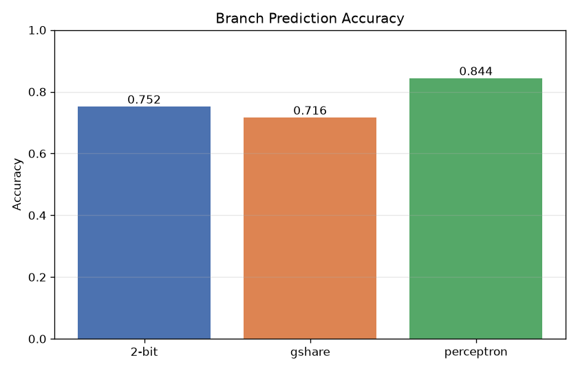
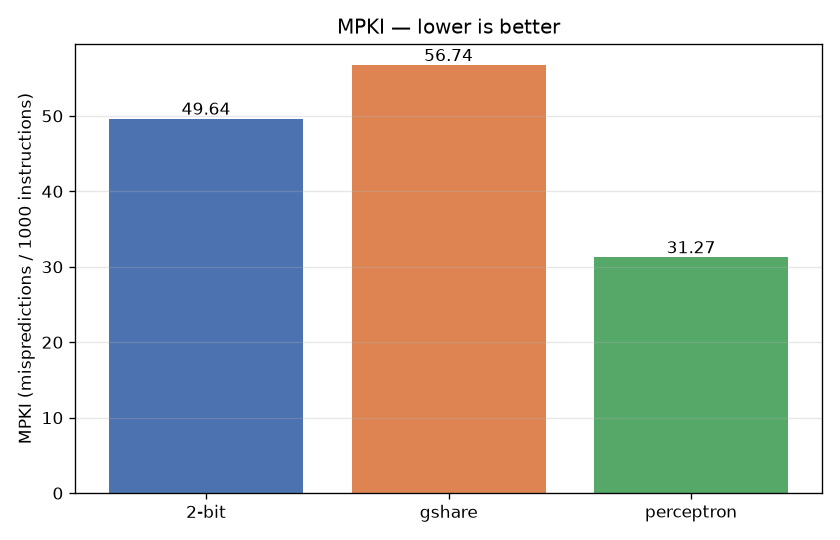
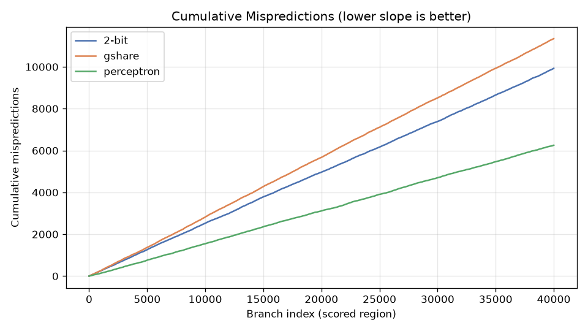
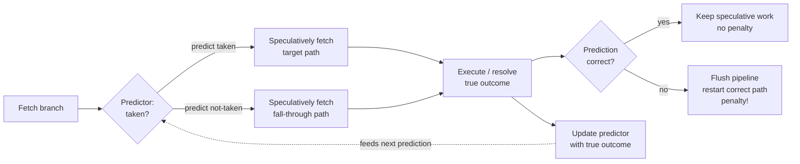
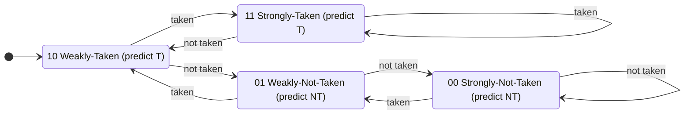
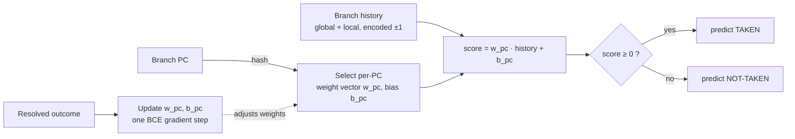
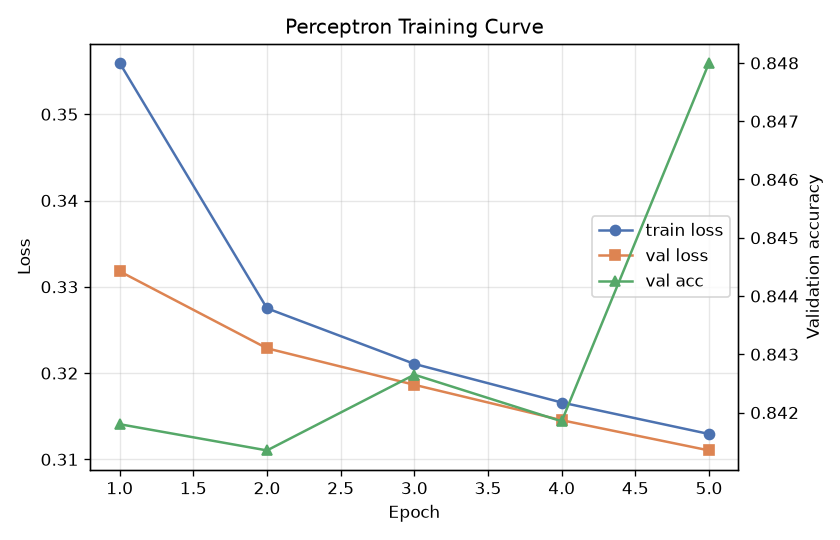
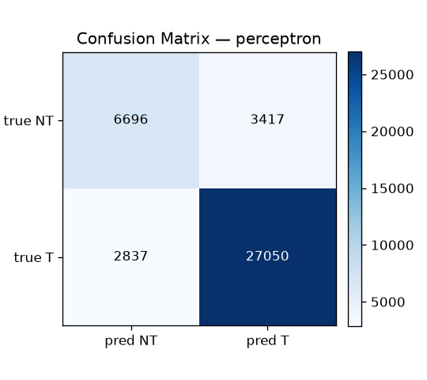
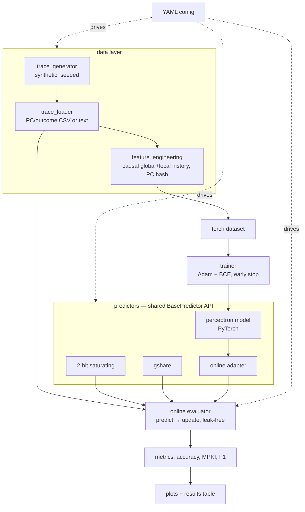

# ML-Based CPU Branch Predictor using PyTorch


A production-quality study of **machine-learning branch prediction**: a PyTorch
**perceptron** predictor is benchmarked, under an identical and leak-free online
protocol, against the classical **2-bit saturating (bimodal)** and **gshare**
hardware predictors — using the metrics computer architects actually care about,
**prediction accuracy** and **MPKI** (mispredictions per 1000 instructions).

> Branch prediction is one of the oldest and highest-impact applications of
> "learning from history" in a CPU. This project treats it as the binary
> sequence-classification problem it really is, and shows a learned predictor
> outperforming strong classical baselines on realistic, history-correlated
> workloads.

---

## Results

Full run on a 200,000-branch synthetic trace (loop-heavy, with history-correlated
branches), scored on a held-out chronological test tail:

<!-- Source: docs/assets/comparison.md, regenerated by scripts/run_comparison.py -->

| Predictor | Accuracy | MPKI | Precision | Recall | F1 | Mispredicts |
|-----------|---------:|-----:|----------:|-------:|---:|------------:|
| **perceptron** | **0.8437** | **31.27** | 0.888 | 0.905 | 0.896 | 6254/40000 |
| 2-bit | 0.7518 | 49.64 | 0.806 | 0.880 | 0.841 | 9928/40000 |
| gshare | 0.7163 | 56.75 | 0.770 | 0.885 | 0.823 | 11349/40000 |

<p align="center">
  
  
</p>
<p align="center">
  
</p>

The perceptron cuts MPKI by **~37%** versus the required 2-bit baseline by
combining the branch PC with global *and* per-PC local history.

> **Why does gshare trail the bimodal predictor here?** This workload is
> loop-heavy, and most branches are strongly biased. Folding global history into
> the index (gshare's core idea) *spreads* each strongly-biased branch across many
> counter entries, which dilutes and slows its convergence — a well-known effect
> that motivates tournament/hybrid predictors in real hardware. gshare only pays
> off on the history-correlated subset. The perceptron gets the best of both: a
> per-PC weight vector that learns which history bits matter for each branch. The
> result is workload-dependent and honestly reported rather than tuned to make ML
> look good.

Reproduce everything with one command:

```bash
make setup      # install deps + package
make compare    # train + evaluate + write results/ and figures
```

---

## Background: what a branch predictor does

Modern CPUs are pipelined: they fetch and begin executing instructions before
earlier ones finish. A **conditional branch** (`if`, loop back-edge, ...) is a
problem — the CPU must keep fetching *before* it knows whether the branch is
**taken** or **not-taken**. A **branch predictor** guesses the direction so the
pipeline stays full; a wrong guess triggers a **pipeline flush**, wasting many
cycles. Better prediction ⇒ fewer flushes ⇒ higher performance.

### Diagram 1 — CPU branch-prediction pipeline



The predictor's contract is exactly two operations, and every predictor in this
repo implements it (`BasePredictor`):

1. `predict(pc)` — guess using only information available **before** the branch
   resolves;
2. `update(pc, outcome)` — learn from the resolved outcome.

---

## The predictors

### 2-bit saturating (bimodal) — the required baseline

A table of 2-bit saturating counters, indexed by the low bits of the branch PC.
The two bits give **hysteresis**: one surprising outcome nudges the counter but
does not immediately flip the prediction, so strongly-biased branches (loops) are
predicted robustly. It has no notion of history, so it cannot capture correlation
*between* branches.

### Diagram 2 — 2-bit saturating counter state machine



### gshare — a stronger classical baseline

gshare (McFarling, 1993) XORs the branch PC with a **global history register**
to index the same kind of saturating-counter table: `index = (pc ^ ghr)`. The same
static branch can now map to different counters depending on the path taken to
reach it, capturing correlation the bimodal predictor cannot.

### Perceptron — the ML predictor

The software analog of the hardware perceptron predictor (Jiménez & Lin, HPCA
2001). It keeps a **table of perceptrons indexed by PC**; each perceptron is a
weight vector dotted with the branch history (encoded as ±1). The sign of the dot
product is the prediction; training nudges the weights toward the correct outcome.
Implemented in PyTorch as per-PC weight/bias `Embedding`s so it trains with
`BCEWithLogitsLoss` yet reduces to a plain dot-product at inference — just like
hardware.

### Diagram 3 — Perceptron branch predictor



<p align="center">
  
  
</p>

---

## Project architecture

Layered and dependency-directed: data → features → predictors → evaluation, with
one shared `BasePredictor` interface so classical and ML predictors run through the
*same* online harness.

### Diagram 4 — Overall project architecture



### Repository layout

```
src/branchpred/
├── data/            trace_generator · trace_loader · feature_engineering
├── baselines/       base_predictor · two_bit_predictor · gshare_predictor
├── models/          perceptron (PyTorch) · ml_predictor (adapter) · torch_dataset
├── training/        config (typed + validated) · trainer
├── evaluation/      metrics (accuracy, MPKI, ...) · evaluator (online harness)
├── visualization/   plots (matplotlib, headless)
├── utils/           seed · logging
└── pipeline.py      end-to-end run_comparison orchestration
scripts/             generate_data · train · evaluate · run_comparison  (thin CLIs)
configs/             default.yaml + experiment overrides
tests/               correctness-focused unit tests (one module per component)
docs/                design.md · datasets.md · assets/ (committed result figures)
```

---

## Dataset

Public branch-trace suites (**Championship Branch Prediction / ChampSim**) exist
and are excellent, but they are access-gated, multi-gigabyte, and stored in a
simulator-specific **binary** format — a poor fit for a self-contained,
reproducible repo. This project therefore supports **both** sources and defaults to
the reproducible one (full analysis in [`docs/datasets.md`](docs/datasets.md)):

- **Synthetic (default):** a seed-deterministic, program-like generator producing
  biased loops, nested loops, PC+history-correlated branches, biased call/return
  branches, and noise — chosen to differentiate the predictors. Every number in
  this README is reproducible with no downloads.
- **Real traces:** the loader ingests any trace in the simple `PC outcome` text/CSV
  form — exactly what you get by decoding a CBP/ChampSim trace. Drop it in
  `data/raw/` and set `data.source: file` in the config.

### Feature engineering is strictly causal

For branch *i*, features use **only** outcomes strictly before *i* (global history,
per-PC local history, hashed PC). The train/val/test split is **chronological**
(never shuffled), mirroring deployment. A unit test asserts there is no
future-outcome leakage.

---

## Evaluation methodology

- **Same protocol for everyone.** The online evaluator streams the trace once,
  calling `predict` then `update` for each predictor. No predictor ever sees an
  outcome before predicting it (enforced by a protocol test).
- **Same held-out tail.** All predictors warm up over the identical train+val
  history and are scored on the identical test slice.
- **Metrics.** Accuracy and **MPKI** (mispredictions per 1000 instructions, using a
  documented `instructions_per_branch` factor), plus precision/recall/F1 and
  confusion matrices to show *how* each predictor errs.

---

## Installation & usage

```bash
# 1. Install (editable) with dev tooling
make setup            # == pip install -r requirements-dev.txt && pip install -e .

# 2. Generate a trace and inspect it
make data             # python scripts/generate_data.py --config configs/default.yaml

# 3. Train the perceptron
make train

# 4. Evaluate one predictor
python scripts/evaluate.py --config configs/default.yaml --predictor gshare

# 5. Full comparison (headline) — writes results/ + figures
make compare
```

Everything is configurable via YAML (see `configs/default.yaml`); an experiment
override only needs to specify what changes:

```bash
python scripts/run_comparison.py --config configs/experiment_perceptron.yaml
```

### Testing & quality

```bash
make test    # pytest — correctness, causality, protocol, and metric tests
make lint    # ruff
make format  # black
```

CI runs lint + the full test suite on Python 3.9 and 3.11.

---

## Limitations & honest notes

- **Synthetic-primary data.** Results are on a reproducible synthetic workload;
  the loader makes real CBP/ChampSim traces drop-in usable, but those are not
  vendored (see `docs/datasets.md`).
- **Software model, not a hardware budget.** The perceptron is evaluated for
  predictive quality; a hardware implementation would additionally trade off table
  size, weight bit-width, and latency. The per-PC table size and history lengths
  are reported so the comparison stays honest.
- **Workload-dependent baselines.** As shown, gshare does not universally beat
  bimodal — the relative ordering depends on the branch mix.

---

## References

- D. A. Jiménez and C. Lin, *Dynamic Branch Prediction with Perceptrons*, HPCA 2001.
- S. McFarling, *Combining Branch Predictors*, WRL Technical Note TN-36, 1993.
- Championship Branch Prediction (CBP) — https://ericrotenberg.wordpress.ncsu.edu/cbp2025/
- ChampSim — https://github.com/ChampSim/ChampSim

## License

Released under the [MIT License](LICENSE).
